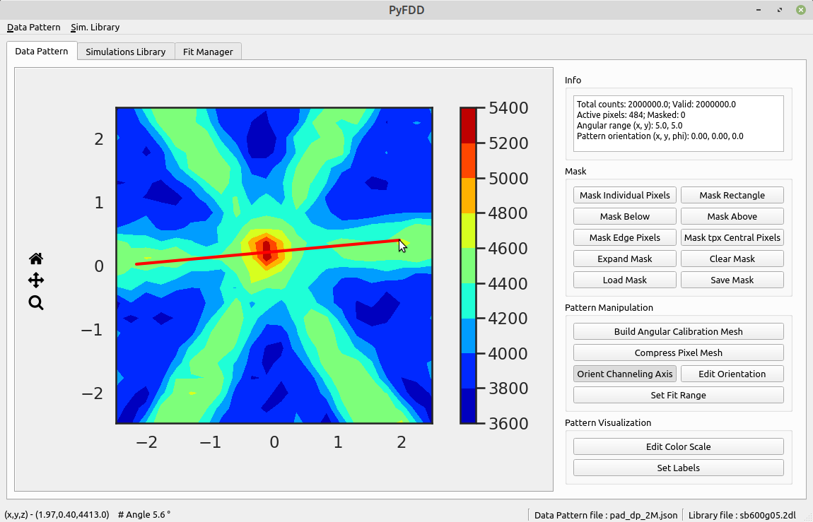
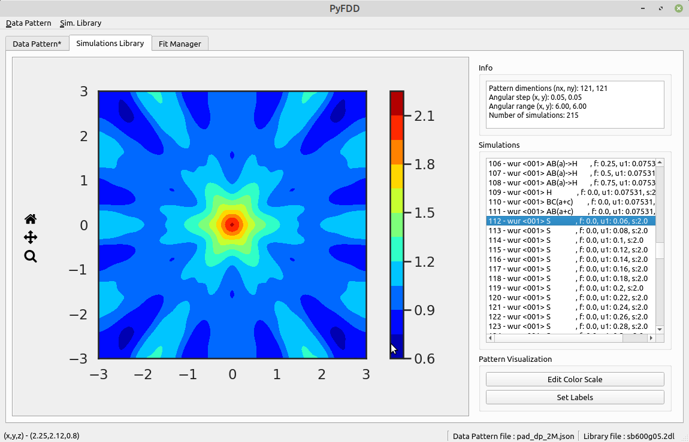

*Corresponding scientific article:* 

*Corresponding PhD Thesis:* 

*Repository archive on Zenodo:* 

# PyFDD

## General usage notes
- PyFDD is a software for fitting channeling data for lattice location;
- Load your data into a Data Pattern to prepare the channeling data;
- Import Simulations Libraries in the .2dl format;
- Use the Fit Manager for fitting;
- For learning how to use the API, start with the examples folder.

## Using the standalone GUI application

- Download the executable from github as use it as it is.

 

## Installation

To use PyFDD you must first have python3 and pip installed. If you download python from python.org and use a version
\>=3.4 it will come with pip. 

pip version >= 19.3 is required.

To install PyFDD on linux run,

> $ pip3 install git+https://github.com/edbosne/pyfdd.git#egg=pyfdd

To upgrade,

> pip3 install --upgrade git+https://github.com/edbosne/pyfdd.git#egg=pyfdd

If you will be using it in jupyter, and you should, you can install it with

> $ pip3 install jupyter

To launch a notebook use the command,

> jupyter notebook

To install PyFDD on windows run (the command can be "py" or "python" depending on how you installed it),

> $ python -m pip install https://github.com/edbosne/pyfdd/archive/master.zip

To upgrade an installed version use,

> pip install --upgrade https://github.com/edbosne/pyfdd/archive/master.zip

If you will be using it in jupyter, and you should, you can install it with

> $ py -m pip install jupyter

To launch a notebook use the command,

> py -m notebook

## Structure

- The DataPattern class holds the pattern from the measurement, the angular calibration and has the necessary tools to set up the pattern for fitting.

- The Lib2dl class reads 2dl libraries and puts them in the format that is necessary for the fit.

- The Fit class does the fit. If one need to do one single fit for testing this class can be used but for regular analysis the FitManager class is advised.

- The FitManager is the general purpose fit class and the most used in practice. It can fit a pattern over several lattice sites and outputs the results in a .csv file that can be opened with excel.

## Licence
PyFDD is open source under a GPL3 license. Please look at the LICENCE.txt file for more info.
